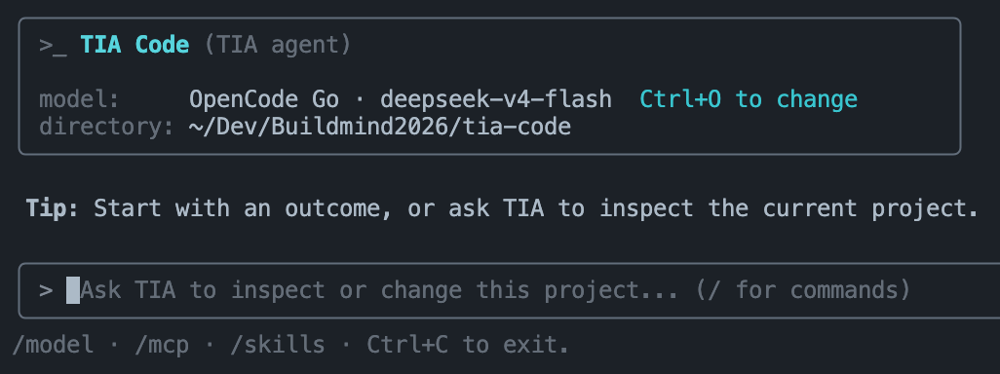

# TIA Code

> A coding agent that works where your code lives: the terminal.

TIA Code turns a plain-language request into useful work in the current project. Ask it to understand a codebase, trace a bug, make a change, run a command, or explain what happened.

It has an interactive terminal experience when you want to collaborate, plus a clean one-shot mode when you want to automate a task.

## See it in action



## What TIA Code can do

- Explore a repository and explain unfamiliar code.
- Investigate bugs and propose or make focused fixes.
- Write, edit, and review code in the current workspace.
- Run project commands and use their results to continue the task.
- Continue saved conversations when work spans more than one session.
- Work with Anthropic, OpenAI, DeepSeek, Kimi, and OpenCode Go models.
- Fit into shell scripts with output that stays on standard output.

## Get started

TIA Code requires Node.js 22.19.0 or later and an API key from one of the providers available during setup.

```sh
npm install -g tia-code
```

Move into the project you want help with, then start TIA Code.

```sh
cd /path/to/your/project
tia-code
```

On first launch, choose a provider and model, then enter its API key. TIA Code stores that configuration locally on your machine.

Now just describe what you need.

```text
Find the source of the slow startup and propose the smallest safe fix.
```

## Work interactively

Use the interactive app for an ongoing conversation about a project. TIA Code keeps the workspace context, can use project skills and connected MCP tools, and shows its progress as it works.

```sh
tia-code
```

Resume a previous interactive session when you want to pick up where you left off.

```sh
tia-code resume <session-id>
```

## Run one task from a script

Use `run` when you need an answer without opening the terminal UI.

```sh
tia-code run "Summarize the changes in this repository."
```

Assistant text is written to standard output. Diagnostics and errors go to standard error, and a failed run exits non-zero.

```sh
review="$(tia-code run 'List the risky files changed in this branch.')"
printf '%s\n' "$review"

tia-code run "Write a release summary for this project." > release-summary.md
```

This makes TIA Code useful in CI helpers, local automation, and any shell workflow where you want a coding agent’s response as text.

## Your workspace, your control

TIA Code uses the directory where you launch it as its workspace. Give it only the repositories you want it to inspect or change, and review requests that may modify files or run commands.

Your provider key is stored locally in `~/.tia-code/config.json` with owner-only permissions. It is not committed to your project or included in the npm package.

Need a separate setup for a disposable environment? Point TIA Code at another local configuration path.

```sh
TIA_CODE_CONFIG_PATH="$PWD/.tia-code-config.json" tia-code
TIA_CODE_CONFIG_PATH="$PWD/.tia-code-config.json" tia-code run "Explain this project."
```

## Open source

TIA Code is maintained by [ZhuXinAI](https://github.com/ZhuXinAI) and released under the [MIT License](./LICENSE).

Source code, issues, and release history live at [github.com/ZhuXinAI/tia-code](https://github.com/ZhuXinAI/tia-code).
